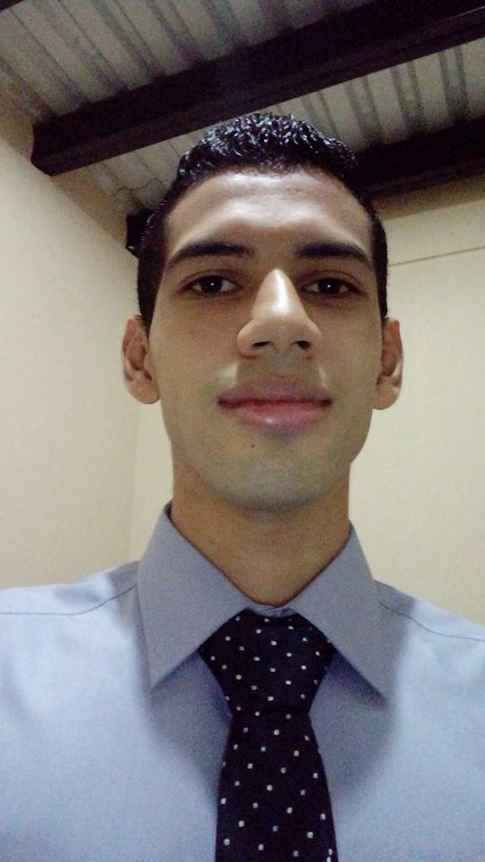

# Punto de Control 8

## :copyright: Autor

- :camera: 

- :man: **JOSHUA DAVID MARTINEZ PONCE**
- :e-mail: Joshuamartinez8723@gmail.com
- :link: [github.com/Joshua](https://github.com/)
- :calendar: 2020-08-30 23:00 CST

---

## :dart: Objetivos

Punto de control #8 de **C++** diseñado para demostrar:

1. :mag: La optimización de:
   - `#include` (mínimo requerido)
   - `using namespace std` (solo cuando se necesita)
2. :open_file_folder:La organización de:
   - Código (**Visual Studio Code** y Repositorio en **Github**)
   - Imágenes (Extensión **Polacode** de **VSC**)
   

---

## :black_circle: Alumno.hpp

---

## :black_circle: Alumno.cpp

---

## :black_circle: Maestro.hpp

---

## :black_circle: Maestro.cpp

---

## :black_circle: Persona.hpp

---

## :black_circle: Persona.cpp

---

## :black_circle: Herencia.cpp

---

## :white_circle: Salida 

---

## :black_circle: Alumno1.hpp

---

## :black_circle: Alumno1.cpp

---

## :black_circle: Maestro1.hpp

---

## :black_circle: Maestro1.cpp

---

## :black_circle: Persona1.hpp

---

## :black_circle: Persona1.cpp

---

## :black_circle: Polimorfismo.cpp

---

## :white_circle: Salida 

---

## :black_circle: Pila.hpp

---

## :black_circle: Enteros.hpp

---

## :black_circle: Doubles.hpp

---

## :black_circle: Cadenas.hpp

---

## :black_circle: MiClase.hpp

---

## :black_circle: MiClases.hpp

---

## :black_circle: Templates.cpp

## :computer: Código

- :blue_book: [Punto de control #7](https://github.com/JoshuaMartinez30/C-_PDC7.git)

---